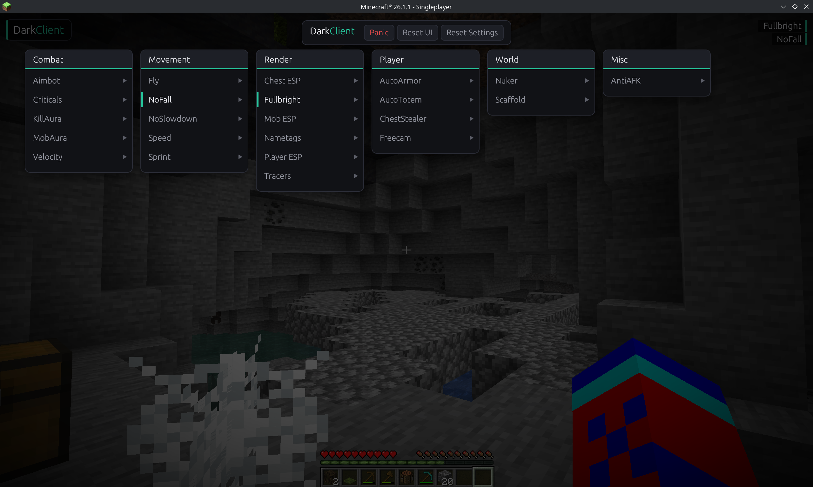

# KRASNOSTAV

[](#)
[](#)
[](#)
[](#)


---

# Architectural Philosophy: Minecraft Client as an IDE

Traditional Minecraft cheat clients (such as Vape, LiquidBounce, or Raven) are built as heavyweight, invasive modifications. They rely on direct Java bytecode manipulation, generate massive garbage collector (GC) overhead inside the JVM, and utilize rigid, outdated GUI overlays (e.g. standard ImGui wrappers) that feel out-of-place and stutter under load.

**KRASNOSTAV** completely redefines the technical paradigm. Written from the ground up in native, thread-safe Rust, it operates as a **modular runtime workspace**—drawing design inspiration from **Visual Studio Code** rather than classic game menus.

### Key Structural Innovations
1. **Zero-Overhead Native Core**: Heavy-lifting computations (packet interception, mathematical modules, spatial rendering calculations) run natively outside the JVM, bypassing GC pressure completely.
2. **VS Code-Style Integrated ClickGUI**: Featuring a unified layout, floating tool docks, a global command spotlight command palette, live markdown diagnostics, and searchable setting filters.
3. **Dynamic Hot-Reloading Scripting & Extensions**: Code is treated as live-reloadable assets. Lua scripts and compiled native plugins can be hot-reloaded instantly at runtime without disconnecting or restarting the client.

---

## 🛠 Project Workspace Topology

The codebase is organized as a modular Rust Cargo workspace:


---

## 💎 Elite Core Features & Architectural Specs

### 1. Custom GPU-Batched & Multi-Pass Effects Renderer
Unlike basic ImGui overlays, KRASNOSTAV implements a custom, high-speed OpenGL-based vector batch rendering queue designed to minimize draw calls and maximize throughput.

```
+------------------+     +------------------+     +------------------+
| Custom Vector    | --> | GPU Vertex Batch | --> | Multi-Pass       | --> Display Output
| Draw Primitives  |     | (GPUPixelVertex) |     | Shader Kernels   |
+------------------+     +------------------+     +------------------+
                                                    - Gaussian Blur
                                                    - SDF Rounded Rects
                                                    - Glowing Shadows
```

- **GPU Batching**: Consolidates all vector shapes, custom textures, and text elements into an unified, dynamic vertex stream (`GPUPixelVertex`), flushing coordinates in single-pass draws.
- **Glassmorphism & Blur**: Uses highly optimized multi-pass Gaussian shader kernels (`client/src/graphic/platform/renderer.rs`) calculating localized weights dynamically on the GPU.
- **SDF Rounded Corners & Shadows**: Renders rounded cards and drop shadows using mathematical Signed Distance Field (SDF) stencil shaders for pixel-perfect glow edges without performance penalties.

### 2. Physical Spring & Inertia Scroll Animations
Animations in KRASNOSTAV are frame-rate-independent and operate against physical simulations, ensuring liquid-smooth transitions at high refresh rates (144Hz+).

- **Spring Solvers**: Driven by Hooke's Law with damping and stiffness parameters, preventing visual popping during transition redirections.
- **Advanced Easing Matrix**: Fully supports `Elastic`, `Bounce`, `Back`, and standard easing equations.
- **Inertia Scrolling**: Employs real physical momentum with exponential velocity decay for smooth scrollbars and panel panning.

```rust
// Physics-based Spring Integration Math Solver in client/src/graphic/anim.rs
let sub_dt = dt / SUBSTEPS_F32;
for _ in 0..SUBSTEPS {
    let displacement = spring.value - target;
    let accel = -cfg.stiffness * displacement - cfg.damping * spring.velocity;
    spring.velocity += accel * sub_dt;
    spring.value += spring.velocity * sub_dt;
}
```

### 3. Drag-and-Drop HUD Framework & Snap Grid
The overlay features a persistent HUD layout editor, allowing complete custom positioning and anchoring of screen-space widgets.

- **Dotted Snap Grid**: Visualizes a layout helper grid when edit mode is toggled, snapping widget boundaries to aligned pixel steps.
- **Anchor auto-snapping**: Intelligently computes the closest corner (Top-Left, Top-Right, Bottom-Left, Bottom-Right) and locks coordinate alignment while updating cascade ordering.

### 4. Direct JNI-to-Netty Packet Interception Pipeline
Intercept, delay, or mutate packets in the low-level JVM Netty pipeline safely from native memory.

```
[JVM Netty Pipeline] <--- (JNI Reflection Hook) ---> [Rust Network Interceptor]
                                                               │ (Thread-Safe Buffer)
                                                               ▼
                                                     [LuaJIT Packet Hook]
                                                               │
                                                               ▼
                                                     [Flushed onto Netty]
```

1. **Pipeline Append**: Append a native `ChannelDuplexHandler` wrapper directly into the active connection's Netty pipeline using JNI reflection.
2. **Buffer Queue**: Packets flagged as `"DELAY"` by Lua or modules are queued into a thread-safe native vector (`Arc<Mutex<Vec<DelayedPacket>>>`).
3. **Timed Re-injection**: Outgoing buffers are checked against timestamps during tick cycles and released safely using `writeAndFlush`.

### 5. Multi-Threaded Native Event Bus
A static, thread-safe Event Bus supports instant dispatching and subscription across modules, native code, and Lua threads.

- **Extensive Event Index**: Designed to support over 100 specialized events (e.g. `Tick`, `Render2D`, `Render3D`, `PacketSend`, `PacketReceive`, `KeyInput`, `MouseInput`, `Chat`, `Attack`, `Movement`, `WorldLoad`, `WorldUnload`).

### 6. Sandboxed Lua Scripting API
The client exposes a highly optimized, completely sandboxed Lua scripting bridge using LuaJIT for peak execution performance.

- **Sandboxed Execution**: Strips hazardous functions (e.g., `os.execute`, `os.remove`, `io.open`) to protect the host operating system, replacing them with secure, scoped alternatives.
- **Exposed Hooks**: Exposes rendering primitives, secure networking queries, sandboxed filesystem storage, packet manipulation, and notifications.

```lua
-- Custom Scripting Settings and Packet Delay Hook
local delay_setting = script:registerSetting("Slider", "DelayMS", "Latency packet buffer", 350.0)

script:onPacketSend(function(packet)
    if packet:getName() == "CPacketKeepAlive" then
        return "DELAY" -- Pushes packet to Rust thread-safe buffer
    end
    return "FORWARD"
end)
```

### 7. Global Spotlight Command Palette
Triggered via `Ctrl+P` or the period key (`.`), the command framework brings command-line precision directly to your fingertips.

- **Reactive Fuzzy Search**: Performs instant lookup of registered modules, config profiles, active themes, or custom scripts.
- **Dot Commands**: Directly executes dot-commands (e.g., `.toggle`, `.bind`, `.config`, `.theme`, `.friend`, `.enemy`, `.reload`) with standard keyboard navigation support.

### 8. Cloud Config & Profile Sync
Synchronize your settings dynamically across machines without managing local files manually.

- **Cloud Backends**: Seamless synchronization supporting raw GitHub Gists, Discord webhook files, and custom API servers.
- **Atomic File Writes**: Prevents JSON file corruption by writing to a temporary `.tmp` file and renaming it atomically on disk.

### 9. Compiled Plugin SDK (Rust & WASM)
Expand client capability beyond Lua scripts using high-performance compiled extensions.

- **Native Rust Plugins**: Compile standalone dynamic libraries (`.dll` / `.so`) implementing our `ClientPlugin` trait.
- **WebAssembly (WASM) Sandbox**: Run WebAssembly bytecode inside a secure virtual machine at runtime, offering both native performance and operating system isolation.

### 10. Abstract Multi-Version Mapping Layer
A unified mapping engine resolves JVM obfuscation schemas and method signatures across Minecraft versions and runtime loader environments.

- **Supported Targets**: Seamlessly translates classes, fields, and method names for Vanilla, Fabric, Forge, Lunar Client, and Badlion Client.

---

## 🎨 Visual Preview

<p align="center">
  
  <br>
  <i>Figure 1: Cohesive Dashboard UI featuring glassmorphism overlays, Spotlight command search, real-time DevTools, and customizable category widgets.</i>
</p>

---

## 🚀 Quickstart & Compilation

### Prerequisite Setup
Ensure you have the Rust toolchain installed (MSRV 1.75+) along with Python 3 for JNI schema mapping generation.

1. **Clone the Workspace**:
   ```bash
   git clone https://github.com/uddcmc/DarkClient.git
   cd DarkClient
   ```

2. **Generate JNI Class Mappings**:
   ```bash
   python conversion.py
   ```

3. **Compile the Injection Agent**:
   ```bash
   cargo build --release
   ```

4. **Inject and Launch**:
   Run the injector to attach the native library directly to the target JVM process:
   ```bash
   ./target/release/injector
   ```

---

## 📜 Technical Licensing

KRASNOSTAV is open-source software licensed under the **GNU General Public License v3.0 (GPL-3.0)**. Refer to the `LICENSE` file for full terms and conditions.
